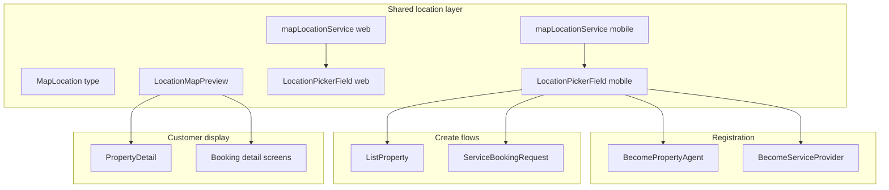

# Location-Aware Registration & Booking (Real Estate + Home Services)

## Current state

| Area | Registration | Listings / bookings | Map |
|------|--------------|---------------------|-----|
| **Rides** | Text address only for drivers | `{ latitude, longitude, address }` required | `GoogleMapView` + `rideService` |
| **Property agents** | Text `address` + `city`; no agent type | `PropertyListing` has optional `latitude`/`longitude` never sent | None |
| **Home services** | Text `address` + `city`; categories via chips | `ServiceBooking` has optional coords never sent | None |

Ride location pattern to mirror ([`appFrontend/src/services/rideService.ts`](appFrontend/src/services/rideService.ts)):

```typescript
{ latitude: number; longitude: number; address: string }
```

Client-side Google Places autocomplete, reverse geocode, and optional GPS — backend stores trusted coordinates.

---

## Architecture



---

## Phase 1 — Shared location infrastructure

### Mobile ([`appFrontend`](appFrontend))

1. **Extract reusable service** — Create [`appFrontend/src/services/mapLocationService.ts`](appFrontend/src/services/mapLocationService.ts) by delegating to existing `rideService` methods (`searchPlaces`, `getPlaceDetails`, `reverseGeocode`, `getCountryCodeFromCoords`). Export shared `MapLocation` type (same shape as ride).
2. **`LocationPickerField` component** — New [`appFrontend/src/components/LocationPickerField.tsx`](appFrontend/src/components/LocationPickerField.tsx):
   - Autocomplete search (min 3 chars, 50 km bias from GPS — same as [`RideRequest.tsx`](appFrontend/src/screens/RideRequest.tsx))
   - "Use current location" button via `expo-location`
   - Read-only resolved address line + editable city field (parsed from geocode or manual fallback)
   - `onChange(location: MapLocation & { city: string })` callback
   - Compact map preview using existing [`GoogleMapView.tsx`](appFrontend/src/components/GoogleMapView.tsx) with a single marker
3. **`LocationMapPreview` component** — Read-only map + "Open in Maps" deep link (`Linking.openURL` with `geo:` / Apple Maps URL). Used on detail/booking screens.

### Web ([`AppWebVersion`](AppWebVersion))

1. **Web location service** — [`AppWebVersion/src/services/mapLocationService.ts`](AppWebVersion/src/services/mapLocationService.ts) calling Google Places/Geocoding REST APIs (same endpoints as mobile `rideService`).
2. **Env** — Add `REACT_APP_GOOGLE_PLACES_API_KEY` to [`.env.example`](AppWebVersion/.env.example) (reuse the key already in [`appFrontend/app.config.ts`](appFrontend/app.config.ts)).
3. **`LocationPickerField` (web)** — [`AppWebVersion/src/components/LocationPickerField.tsx`](AppWebVersion/src/components/LocationPickerField.tsx): autocomplete dropdown, browser geolocation API for "Use my location", embedded Google Maps iframe or `@react-google-maps/api` if already in deps (otherwise lightweight iframe static map for preview).
4. **`LocationMapPreview` (web)** — Static/interactive map embed on detail pages.

---

## Phase 2 — Backend schema & API

### Prisma migration ([`appBackend/prisma/schema.prisma`](appBackend/prisma/schema.prisma))

| Model | New fields |
|-------|------------|
| `PropertyAgentApplication` | `specializationTypes Json` (array of `PropertyListingType`), `latitude Float?`, `longitude Float?` |
| `PropertyAgent` | `specializationTypes Json?`, `latitude Float?`, `longitude Float?` |
| `ServiceProviderApplication` | `latitude Float?`, `longitude Float?` |
| `ServiceProvider` | `latitude Float?`, `longitude Float?` |
| `PropertyListing` | Add `@@index([latitude, longitude])` |

`ServiceBooking.serviceLatitude/serviceLongitude` already exist — no schema change needed.

### API updates

**[`propertyAgents.ts`](appBackend/src/routes/propertyAgents.ts)**
- Accept `specializationTypes: string[]` (validate each value against `PropertyListingType` enum; require ≥1)
- Accept `latitude`, `longitude`; require both when `address` is provided
- On approve: copy `specializationTypes`, `latitude`, `longitude` to `PropertyAgent`

**[`propertyListings.ts`](appBackend/src/routes/propertyListings.ts)**
- Require `latitude` + `longitude` on `POST /` (parseFloat, range check)
- Return coords in all listing GET responses (already in schema)

**[`serviceProviders.ts`](appBackend/src/routes/serviceProviders.ts)**
- Accept + require `latitude`/`longitude` on apply
- Copy to `ServiceProvider` on approve
- Allow `PATCH /profile` to update `address`, `city`, `latitude`, `longitude`

**[`serviceBookings.ts`](appBackend/src/routes/serviceBookings.ts)**
- Require `serviceLatitude` + `serviceLongitude` on `POST /` alongside `serviceAddress`

### Frontend API clients

Update types + payloads in:
- [`appFrontend/src/services/realEstateApi.ts`](appFrontend/src/services/realEstateApi.ts)
- [`AppWebVersion/src/api/realEstateApi.ts`](AppWebVersion/src/api/realEstateApi.ts)
- [`appFrontend/src/services/homeServicesApi.ts`](appFrontend/src/services/homeServicesApi.ts)
- [`AppWebVersion/src/api/homeServicesApi.ts`](AppWebVersion/src/api/homeServicesApi.ts)

---

## Phase 3 — Property agent & real-estate UX

### Become Property Agent (mobile + web)

Files:
- [`appFrontend/src/screens/real-estate/BecomePropertyAgent.tsx`](appFrontend/src/screens/real-estate/BecomePropertyAgent.tsx)
- [`AppWebVersion/src/pages/real-estate/BecomePropertyAgent.tsx`](AppWebVersion/src/pages/real-estate/BecomePropertyAgent.tsx)

Changes:
1. **New step: "Specializations"** — Multi-select chips for `HOTEL`, `APARTMENT_RENTAL`, `HOME_SALE`, `LAND_SALE` (same labels as [`ListProperty.tsx`](appFrontend/src/screens/real-estate/ListProperty.tsx)). Informational only per your choice — does not gate listing creation.
2. **Replace plain address/city inputs** with `LocationPickerField` on the location step.
3. **Align web/mobile parity** — unify step order (address on step 1 with personal info on mobile; web currently differs), include `licenseNumber` on web submit.
4. Update review step to show selected specializations + map pin preview.

### List Property (mobile + web)

Files:
- [`appFrontend/src/screens/real-estate/ListProperty.tsx`](appFrontend/src/screens/real-estate/ListProperty.tsx)
- [`AppWebVersion/src/pages/real-estate/ListProperty.tsx`](AppWebVersion/src/pages/real-estate/ListProperty.tsx)

Replace text `address`/`city` fields with `LocationPickerField`; send `latitude`/`longitude` in create payload.

### Customer booking experience

| Screen | Change |
|--------|--------|
| [`PropertyDetail`](appFrontend/src/screens/real-estate/PropertyDetail.tsx) (mobile + web) | Add `LocationMapPreview` below address when coords exist; tappable "Get directions" |
| [`PropertyBookingForm`](appFrontend/src/screens/real-estate/PropertyBookingForm.tsx) | Show read-only map of property location above date/guest fields so user confirms location before paying |
| [`PropertyListingBrowse`](appFrontend/src/screens/real-estate/PropertyListingBrowse.tsx) | Show city + optional distance badge when user grants location (sort nearest first — optional stretch) |
| [`MyPropertyBookings`](appFrontend/src/screens/real-estate/MyPropertyBookings.tsx) / detail | Map link on confirmed bookings |

Stay booking flow stays: **browse → detail (map) → book (dates/guests + location confirm) → pay**. Inquiry flow (home/land sale) gets map on detail only.

---

## Phase 4 — Home & professional services UX

### Become Service Provider (mobile + web)

Files:
- [`BecomeServiceProvider.tsx`](appFrontend/src/screens/home-services/BecomeServiceProvider.tsx) (both platforms)

Replace step 2 "Location" text inputs with `LocationPickerField`; submit `latitude`/`longitude`.

### Service booking (mobile + web)

| Screen | Change |
|--------|--------|
| [`ServiceBookingRequest`](appFrontend/src/screens/home-services/ServiceBookingRequest.tsx) | Replace address textarea with `LocationPickerField` ("Where should the service happen?") |
| [`ServiceBookingDetail`](appFrontend/src/screens/home-services/ServiceBookingDetail.tsx) | Map preview of `serviceAddress` + coords for customer |
| [`ServiceProviderBookingDetail`](appFrontend/src/screens/home-services/ServiceProviderBookingDetail.tsx) | Map preview + "Navigate to job" for provider |
| [`ServiceProviderDetail`](appFrontend/src/screens/home-services/ServiceProviderDetail.tsx) | Optional: show provider base location map if coords on profile |

Booking flow: **category → provider → request (map-picked address) → quote → accept → pay** — map visible at request and on active bookings.

---

## Phase 5 — Polish & consistency

- **Validation messages** — Clear UX when user skips location: "Please search or use current location to pin your address on the map."
- **Backward compatibility** — Existing records without coords: detail pages fall back to text address only (no map). New submissions require coords.
- **Admin approval flows** — No change needed; coords and specializations stored on application and copied on approve.
- **Run migration** — `npx prisma migrate dev` in `appBackend`.

---

## Files touched (summary)

| Layer | Key files |
|-------|-----------|
| New shared | `mapLocationService.ts`, `LocationPickerField.tsx`, `LocationMapPreview.tsx` (×2 platforms) |
| Schema | `schema.prisma` |
| Backend routes | `propertyAgents.ts`, `propertyListings.ts`, `serviceProviders.ts`, `serviceBookings.ts` |
| Real estate UI | `BecomePropertyAgent`, `ListProperty`, `PropertyDetail`, `PropertyBookingForm` (×2) |
| Home services UI | `BecomeServiceProvider`, `ServiceBookingRequest`, booking detail screens (×2) |
| Config | `AppWebVersion/.env.example` |

---

## Out of scope (future)

- Agent specialization gating listing types (you chose informational only)
- Live provider tracking (ride-style WebSocket)
- Radius/geo search API on backend (city text filter remains; distance badge is client-side only)
- Listing admin approval endpoint (`PENDING_REVIEW` listings)
